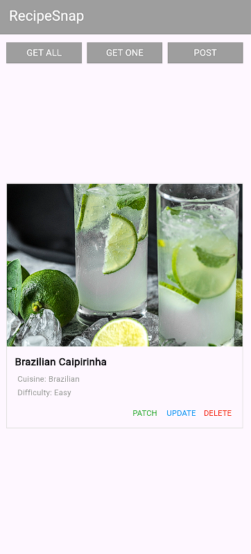

# RecipeSnap

A minimalist Flutter recipe application built using **Provider** and the **HTTP** package.

The app consumes data from the DummyJSON Recipes API and demonstrates full CRUD operations:

- GET
- POST
- PUT
- DELETE

---

## Preview

<p align="center">
  
</p>

---

## Tech Stack

- Flutter
- Provider
- HTTP
- DummyJSON API

---

## Features

- Fetch recipes
- Add recipe
- Update recipe
- Delete recipe
- Loading & error handling
- Minimal UI

---

## API

```text
https://dummyjson.com/recipes
```

---

## Author

Samuel Abraham UGR/0041/16